# VIP-BMS Detailed Teardown: Schematics, parts and working
This is a logic board  of which I obtained from a 20S **VIP-BMS** module designed and manufactured by **Dongguan Weimei Guanze Electronic Technology Co., LTD.** As earlier hinted, the board is used as part of a battery management System for an at most 20-Series Lithium-ion rechargeable battery pack. It comes across as the best case study for an embedded system environment as one slowly draws the curtains and investigates the various components integrated within the system which reveals so much more about how mainstream companies tackle embedded system design.

## Table of Contents
- [Logic Board Overview](#logic-board-overview)
- [Slave Controller](#slave-controller)
- [Main Microcontroller](#main-microcontroller)
- [2nd Microcontroller](#second-microcontroller)
- [CAN Bus Interface](#can-bus-interface)

<h2 id="logic-board-overview">Logic Board Overview</h2>

It follows a modular BMS architecture which consists of a master, slave and various communication protocols. Two microcontrollers are used as the master controllers where each is assigned a slave and one of them assigned higher level functions such as communication. 
Two **Analog Front End (AFE) devices** are used as the slave controllers.

<!-- <> -->

**FRONT:**
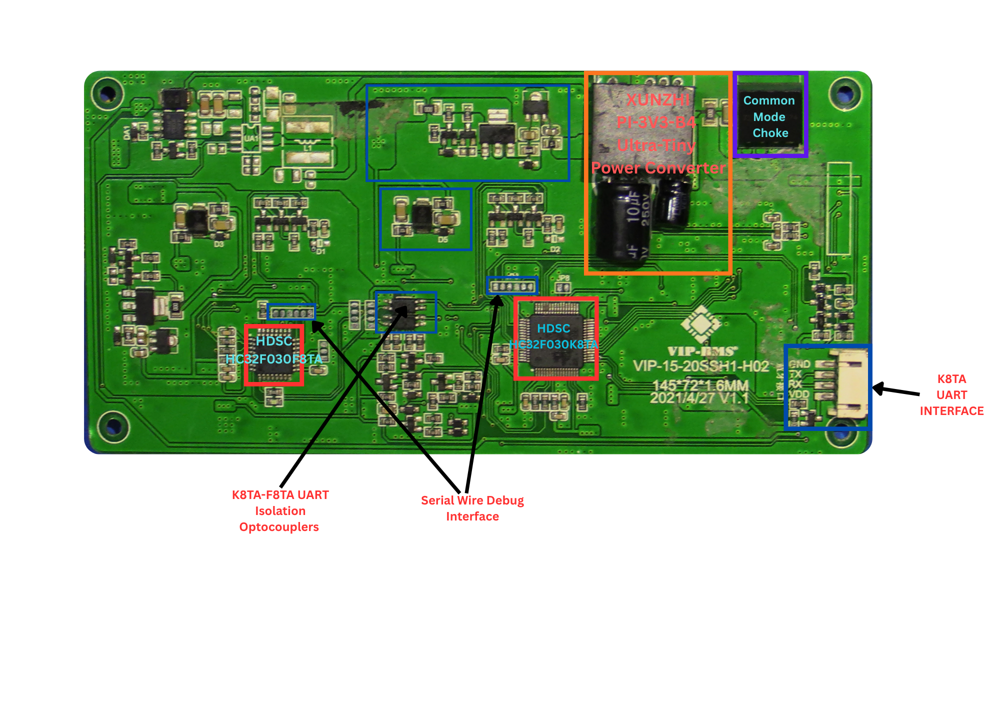

**BACK:**
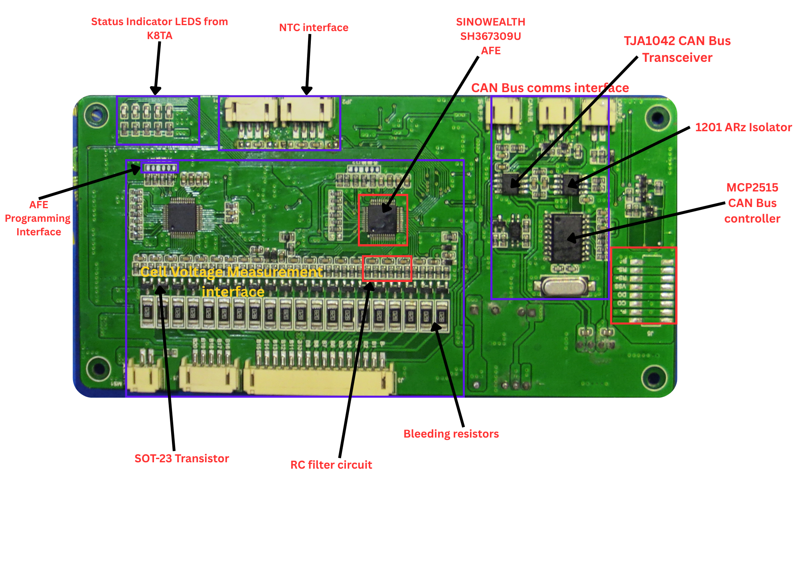

 The slave controllers implement passive balancing and can support up to 20 cells with a minimum of 5 cells in series required. Generally the BMS performs functions such as Over Voltage & Under Voltage protection, Charge & Discharge control, Cell, Temperature & Current measurement and communication. What stands out most is the consistent isolation of sensitive components from the high voltage the BMS handles which is around 84.0V maximum or  74.0V nominal. This BMS is suitable for E-bike battery packs  which normally operate at such voltages. 
 A standard  parameter for an E-bike battery pack would be: 
  - Nominal Voltage: 74.0V 
  - Capacity: 45 Ah 
  - Power: 3,330.0 Wh 
  - Charge Voltage: 84.0V 
  - Operating voltage range: 84.0V - 60.0V

It has 5 indicator LEDS which may flash to indicate various faults which may be caused by conditions such as:

1. COV (Cell Over-Voltage)
2. CUV (Cell Under-Voltage)
3. SOCC (Short-circuit or Over-Current in Charge) 
4. SOCD (Short-circuit or Over-Current in Discharge)
5. ASCD (Advanced Short-Circuit in Discharge). 

 It also has a CAN Bus port for communication and a UART port also for communication. 

In a nutshell this is how the BMS works. The **slave controller** is configured with various parameters such as Maximum & Minimum Battery Pack Voltage, Maximum allowable continuous Charge & Discharge Current, Maximum deviation between highest and lowest cell voltage etc which it stores internally. It then continuously measures parameters such as individual cell voltage, pack voltage, power consumption, temperature etc using internal ADC circuits and temporarily stores the parameters internally from which the Microcontroller can access all the data via a communication protocol such as **Two Wire Interface (TWI) or I2C** as its popularly known and perform analysis according to the flashed program. These Microcontrollers are often interfaced with communication protocols such as Serial Peripheral Interface (SPI), I2C and UART which means that system parameters can be configured via UART or CAN Bus in the case of swapping to a different cell configuration or changing power consumption needs.

The slave controller also monitors and controls Charge and Discharge by controlling charge and discharge MOSFETS which are contained in a different PCB due to the high current handled. The MOSFETS are usually connected in parallel to handle current safely and have metal heat sinks to ensure efficient heat dissipation during operation.

<h2 id="slave-controller">Slave Controller:   SINOWEALTH SH367309U Analog Front End IC</h2>
The SH367309 from SINOWEALTH is an analog front-end IC for Lithium battery BMS that is suitable for lithium battery packs with a total voltage not exceding 70V. It features a 36 pin TQFP48L package with channels for voltage, current and temperature measurement as well as control. Here, I'm going to mostly highlight  those pins with functions that stand out most.

It works in three modes namely:
  - Protect mode
  - AFE mode
  - Ship Mode

In **protect** mode the SH367309 can protect lithium battery packs independently by providing Overvoltage & Undervoltage Protection, Charge & Discharge Overcurrent protection, Short Circuit Protection, temperature protection. To enable protect mode, pin 45 (MODE Pin) is tied to gnd.

In **AFE mode** it can be paired with a microcontroller to manage lithium battery packs while supporting all protection highlighted in protect mode. The MCU can read and write the SH367309's internal register via TWI communication (SDA & SCL). For the AFE to go into AFE Mode, pin 45 (MODE Pin) is pulled high by tying it to VBAT via a 10kΩ resistor with pin 43 (SHIP) also being tied to VBAT

It has a 13-bit integrated VADC for cell voltage, current, and temperature measurements, with 20 measurement channels: 16 for cell voltages, one channel for current, and three channels for temperature. It also includes a 16-bit CADC for current measurement used for remaining capacity estimation.
The SH367309U has registers that are divided into RAM and EEPROM registers. All measured values are stored within RAM registers.

The **RAM registers** are  made up of various registers which are used to store the outlined cell values such as temperature, voltage, & current from the ADC reading and have been assigned the addresses 0x40-0x72.
The **EEPROM registers** have the addresses 0x00–0x19. 
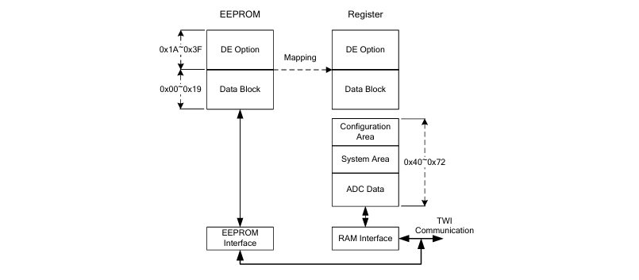

EEPROM registers 1 & 2 are the system configuration registers namely SCONF1 and SCONF2. 
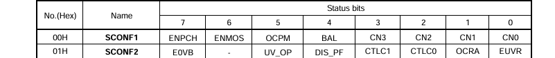
**SCONF1** is used to configure the cell configuration parameters(Bits 0-3), balance control(Bit 4), Over Current Mosfet control(Bit 5), Charge Mosfet Recovery control(Bit 6), Precharge enable control(Bit 7). For cell configuration the SH367309 can handle 5-16 cells in series configuration. The 4 lower bits of the system configuration channel can be used to indicate the pack config e.g 0101 -> 5s, 1010 ->10s
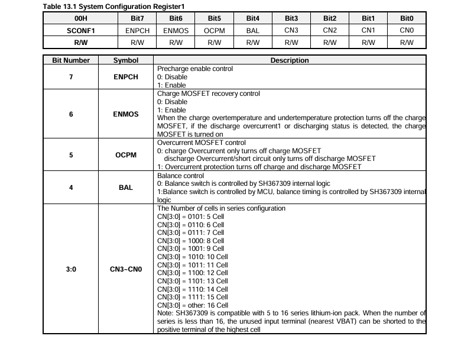

  ### Operation
Cell terminals are connected to pins VC1-VC16 of the AFE allowing measurement of cell voltages, current measurement is done through RS+ & RS- and temperature via T1 - T3.
The cell voltage measurement results are stored in the individual Cell Voltage Measurement Registers as signed 16-bit values. In this logic board's configuration, cells 1-10 are connected to the first AFE and cells 11-20 the second AFE.
Each cell is assigned two register bytes (`CELLx_H` and `CELLx_L`) to form the resultant 16-bit value, where `x` is the cell index. For example, the Cell 1 which is the cell at **VSS** has a cell voltage measurement register uses addresses `0x4E` and `0x4F`, while Cell 16 which is the cell at **VBAT+** has a cell voltage measurement register which uses addresses `0x6C` and `0x6D`.
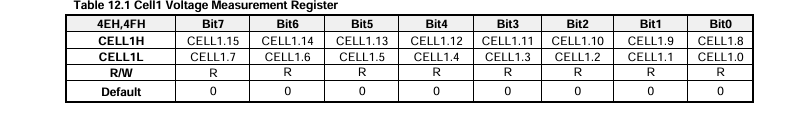
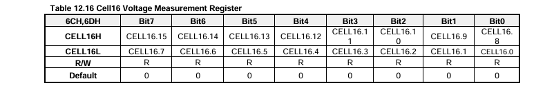
The measurement result is then calculated using the formula:

**Vcell_x = CELLx × (5 / 32)**
(where `x` is replaced with the 16-bit register value for cell `x`).

The **current measurement register** is assigned the address 4CH, 4DH with current calculated as: **Current = (200 X CUR)/ (26837 X Rsense)**
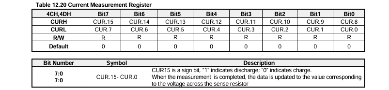
Integrated EEPROM used to save adjustable parameters such as protection threshold and delay
The Integrated TWI communication is used for data transmission in AFE mode. Here the SH367309U acts as a slave and has a fixed address.

The **Temperature Measurement Registers** are assigned the addresses **T1: 0x46, 0x47** ,**T2: 0x48, 0x49** , **T3: 0x4A, 0x4B**. 
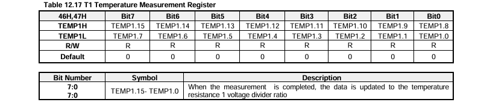

The Temperature calculation formula when using T1 as an example being:

 **Rt1 = (TEMP1)/(32768-TEMP1) x Rref**  
Where units are in Kilo Ohm, Rt1 is the external thermistor resistance, Rref is the internal reference resistance and TEMP1 is the T1 register value which can be based on the resistance between the external thermistor resistance Rt1 and the temperature relationship to obtain true temperature value.

When  operating in AFE mode  the cell voltage, pack current and temperature parameters are read by the microcontroller via TWI. Each AFE is paired with it's own MCU probably because the second AFE handles a much higher voltage which might be disastrous to an MCU. This is also a failsafe since in case of damage the main MCU will still be able to communicate any underlying issues. Recalling earlier,  a single AFE can handle upto 16 cells and upto 70V. To achieve 10 cells or around 42 V per AFE, all remaining pins are tied to main positive. 

 ###  Cell Taps to SH367309U Circuit Diagram

<figure class="zoom-figure">
  <a href="bms-breakdownImages/SH367309U_AFE_Circuit_diagram.svg" target="svg-viewer" class="svg-link" data-svg-src="bms-breakdownImages/SH367309U_AFE_Circuit_diagram.svg">
    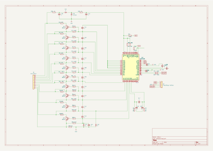
  </a>
  <figcaption>Click the diagram to open it in a larger viewer .</figcaption>
</figure>

 From the circuit diagram one can clearly see the whole electronic ecosystem surrounding the SH367309U AFE chip. The 82 ohm bleeding resistors are used to implement passive balancing while the RC network is used as a low pass filter for the SH367309U's internal ADC which captures cell voltages. Pins VC11-VC17 are tied together to enable a 10 cells in series configuration as outlined by the data sheet. VBAT+ is the main negative and connected to the psoitive terminal of the 10th cell while B0/B- is the main negative which is connected to the negative terminal of the 1st cell. The **MODE** pin of the AFE is pulled up to VBAT+ using a 1K resistor for AFE mode.

<h2 id="main-microcontroller">Main Microcontroller: HDSC HC32F030 K8TA</h2>

Among the microcontrollers paired with the SH367309U AFEs is the **HC32F030 K8TA from HUADA Semiconductors**. This is a 64 pin Microcontroller with an LQFP package that is built around a 48MHz ARM Cortex-M0+ 32-bit CPU platform.

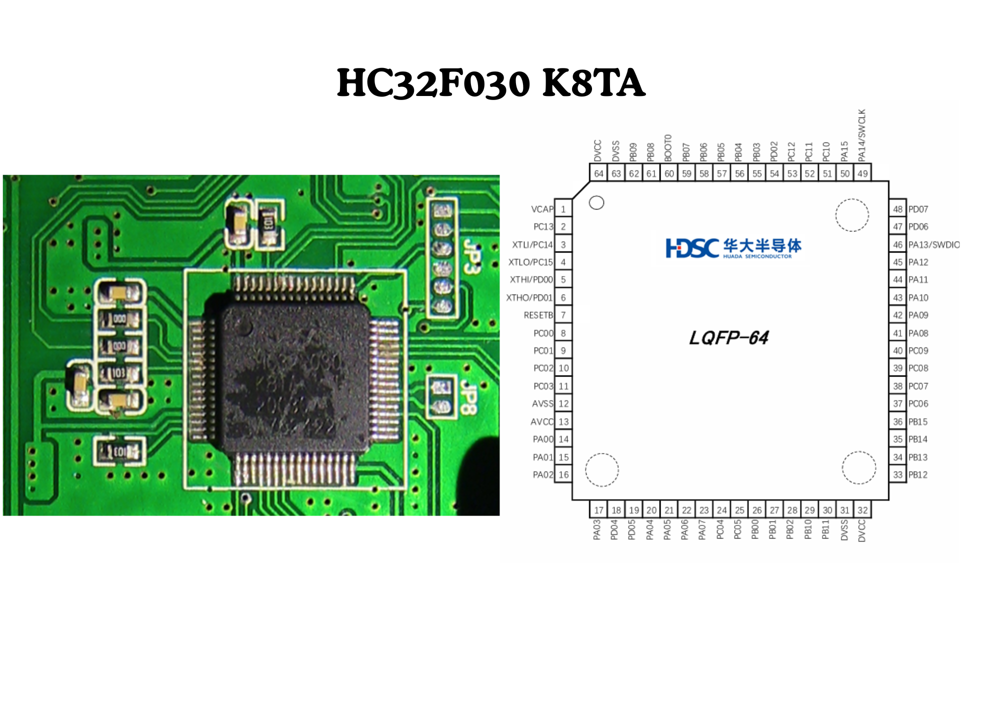

It comes with 8 KBytes of RAM & 64 KBytes of Flash memory for program storage which includes protection features to prevent unauthorized R/W operations and offers upto 56 General Purpose I/O.

It contains a rich set of timers for various applications such us:
 - 3x 1-channel complementary 16-bit timers (TIM0, TIM1, TIM2).
 - 1x 3-channel complementary 16-bit timer (TIM3).
 - 3x High-performance 16-bit timers with PWM, complementary outputs, and dead-zone protection (TIM4, TIM5, TIM6).
 - 1x Programmable Counter Array (PCA, 16-bit) for capture/compare and PWM.

1x 20-bit Watchdog Timer (WDT) with a dedicated internal 10KHz oscillator.
The K8TA supports the following communication interfaces:
  - 2x UART for serial communication.
  - 2x SPI for high-speed synchronous serial communication.
  - 2x I2C for multi-master, low-speed bus communication.
It is designed with flexible power managment system with a very fast wakeup time (4us) and offers several low power modes  such as: 
 - Deep Sleep Mode
 - Sleep Mode

It also includes an SWD interface for full-featured debugging via it's SWCLK(Pin 49), SWDIO (Pin 46), RESET(PIN 7), VCC(Pin 64, 32) & GND(Pin 63, 31) pins which have exposed pads on the logic board.  It operates on 3.3V logic which is supplied to the DVCC & AVCC pins of the MCU via an LDO namely the **PI-3V3-B4 Ultra-Tiny Power Converter** from **XUNZHI**.
The K8TA can be described as the main microcontroller where all outgoing communication is handled i.e CAN Bus, UART. There's a dedicated **UART port (VCC, RX, TX, GND)** on the logic board where **TX** is connected to **UART1_TXD (Pin 16)** and **RX** connected to **UART1_RXD (Pin 17)**. This  can then be interfaced with something like a **UART to BLE converter** for wireless parameter logging. 
This configurations can as well occur over CAN Bus since the K8TA's SPI_0 pins are interfaced with a [CAN controller](#can-bus-interface) to enable communication via CAN Bus. 

<figure class="zoom-figure">
  <a href="bms-breakdownImages/hc32f030_k8ta.svg" target="svg-viewer" class="svg-link" data-svg-src="bms-breakdownImages/hc32f030_k8ta.svg">
    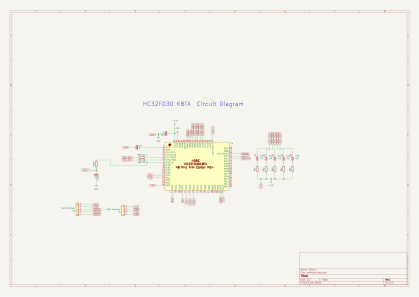
  </a>
  <figcaption>Click the diagram to open it in a larger viewer.</figcaption>
</figure>

It is paired to the first SH367309U AFE, which measures cells one through ten (1-10), via Two Wire Interface (TWI). The AFE therefore sends all its data to the MCU via TWI where SDA & SCL (Pins 27 & 26) from the SH367309U are connected to pins 5 & 6 of the MCU which represent I2C0_SDA & I2C0_SCL respectively. There are 0 ohm resistors on the TWI interface which act as a fuse incase of situations that may damage the MCU.
The K8TA also acts as a master to the second microcontroller which is interfaced to it via UART using two optocouplers for isolation on the RXD and TXD lines.

<h2 id="second-microcontroller">2nd Microcontroller:  HDSC HC32F030 F8TA</h2>

The **HC32F030 F8TA** from Huada Semiconductors is a 32-pin Microcontroller LQFP with an LQFP package also built around a 48MHz ARM Cortex-M0+ 32-bit CPU platform. Just like the K8TA, the F8TA comes bundled with 8 Kbytes of RAM and 64 Kbytes of Flash for program storage with the main difference being a much smaller range of usable GPIO pins (only 26 usable GPIO).

It is the second MCU on the logic board and is connected to the second SH367309U AFE which measures cells 11 through 20 (11-20). It is interfaced to the SH367309 via TWI where the SDA and SCL from the SH367309U are connected to pins 2 and 3 (I2C0_SDA, I2C0_SCL) of the F8TA MCU. The F8TA is different from the K8TA in that it is a 32 pin LQFP package as compared to the 64 pin K8TA. The F8TA AND K8TA are interfaced via the F8TA's UART interface pins 8 & 9 which are UART1_TXD & UART1_RXD respectively and pins 58 & 59 of the K8TA. One thing that stands out is the total isolation between the F8TA and K8TA. 
This is indicated by the two optocouplers placed within the UART interface that is necessary to avoid damaging the K8TA due to the much larger voltage handled by the F8TA system.
The F8TA is supplied with 3.3V to its decoupled DVCC and AVCC input pins via a dedicated LDO power conversion circuit where the main battery voltage is stepped down to 5V before being stepped down again to 3.3V suitable for the MCU.

<h2 id="can-bus-interface">CAN Bus Interface</h2>
There's a CAN Bus port on this VIP BMS logic board which  enables interfacing via CAN Bus. This system is made up of a CAN controller and a CAN transceiver with a galvanic isolator between the two. There's also a dominant state detection circuit that bypasses the transceiver and goes to the MCU for use as a faulty transceiver detection circuit. What stands out most within the CAN communication interface is the  high level isolation implemented within the system. 

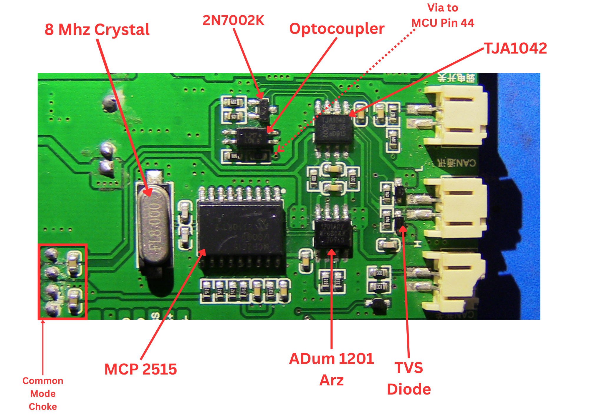

<figure class="zoom-figure">
  <a href="bms-breakdownImages/CAN_BUS_INT_SVG.svg" target="svg-viewer" class="svg-link" data-svg-src="bms-breakdownImages/CAN_BUS_INT_SVG.svg">
    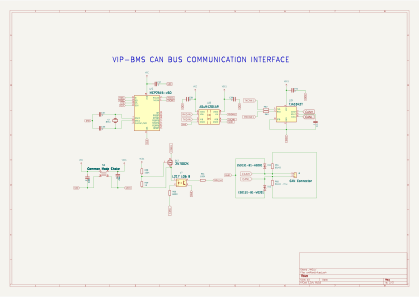
  </a>
  <figcaption>Click the diagram to open it in a larger viewer.</figcaption>
</figure>

 The CAN controller chosen here was the **MCP2515** Stand-Alone CAN Controller with SPI Interface from Microchip Technology incorporated. It is an 18 pin PDIP that also requires an external crystal  and is capable of transmitting and receiving both standard and extended data and remote frames. The MCP2515 has two acceptance masks and six acceptance filters that are used to filter out unwanted messages, thereby reducing the host MCU’s overhead. The MCP2515 is interfaced with the HDSC HC32F030 K8TA via its SPI pins: Pin 20(SPI0_CS),Pin 21(SPI0_Clk), Pin 22(SPI0_MISO), Pin 23(SPI0_MOSI). 

The CAN transceiver selected here was the **TJA1042** high-speed CAN transceiver from NXP Semiconductors which provides an interface between the Controller Area Network (CAN) protocol controller(MCP2515) and the physical two-wire CAN bus. It has an 8-pin DIP package and includes features such as: High ESD handling capability on the bus pins (±8 kV), High voltage robustness on CAN pins (±58 V), Very low-current Standby mode with host and bus wake-up capability.

The galvanic isolator chosen was the **ADuM1201 dual-channel digital isolators** from Analog devices that incorporate the iCoupler technology which combines high speed CMOS and monolithic transformer technologies to provide outstanding performance characteristics that are superior to other alternatives such as the commoonly used optocouplers. 
The ADuM  1201 isolator provides two independent  isolation channels in a variety of channel configuarations and data rates  with low pulse width distortion.

